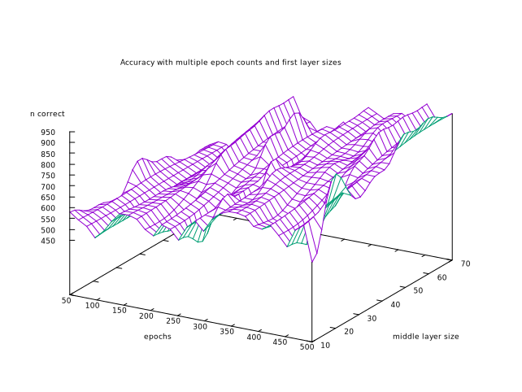

<h1 align="center">
pytorch-experiments
</h1>

There is a [framework](torch-experiments/src/torchexperiments) in this repository that can be used to experiment with training [PyTorch](https://github.com/pytorch/pytorch) neural networks. It focuses on experimenting with different parameters during training of the neural networks as they learn a mathematical function. Mathematical functions are easy to write, can be endlessly complex and you can generate millions of records of data and labels automatically. The framework however is designed to be generic in the way it trains networks, so you should also be able to test an image classifying network for example. There is also a [script](main.py) that you can use to execute experiments with the framework using the command line.

For analysis purposes, there are [scripts](data-collection) that use [GNU Parallel](https://www.gnu.org/software/parallel/) to generate the data and [scripts](data-visualization) that use [gnuplot](http://www.gnuplot.info/) to visualize the data. For example, this is a plot showing the accuracy of a network when learning the `xor` function, for multiple counts of training epochs and middle layer sizes:

# CLI Tool

You can run the `main.py` script with any of the arguments below. The script is designed to be a CLI tool that is easy to use in combination with GNU Parallel to collect multiple samples with different parameters in parallel.

### Positional arguments

- function {`and`,`xor`,`avg`}, specify the function to learn, for more information, see the section below.

### Optional arguments

- `-h`, `--help` Show all available parameters.
- `-ep`, `--epochs`, Number of epochs to run.
- `-bs`, `--batch`, Number of samples per batch.
- `-lr`, `--learning-rate`, Learning rate of optimizer.
- `-lor`, `--loss-restart`, Restart the learning process if the epochs in the first interval result in less loss minimization than the specified percentage. If 0 (default), there is no restart and the training will never be restarted.
- `-los`, `--loss-stop`, Stop the learning process if there is less loss minimization than the specified percentage. If 0 (default), there is no stop and the training will never be stopped.
- `-lof`, `--loss-function`, Loss function to use to compute loss. The options are listed in the section below.
- `-op`, `--optimizer`, Optimizer to use to learn. The options are listed in the section below.
- `-ei`, `--epoch-interval`, Interval in which the loss conditions is checked and the current running loss is logged during the training process.
- `-ll`, `--logging-level`, Logging level to use: 40=ERROR, 20=INFO, 10=DEBUG, higher number means less output.
- `-ts`, `--training-size`, Specifies how much training data is generated.
- `-vs`, `--validation-size`, Specifies how much validation data is generated.
- `-lf`, `--logging-file`, Option to log to file. If option is not specified, all output is sent to stderr.
- `-of`, `--output-format`, Output format, default is `csv`, other option is `human`.

# Functions

These are the functions that are implemented and can be used to train a neural network:

- [`and`](torch-experiments/src/torchexperiments/functions/andf.py): Outputs either 1 or 0 based on the AND evaluation of two floats (where less than 0.5 means 0, and more than 0.5 means 1).
- [`xor`](torch-experiments/src/torchexperiments/functions/xor.py): Outputs either 1 or 0 based on the XOR evaluation of two floats (where less than 0.5 means 0, and more than 0.5 means 1). 
- [`avg`](torch-experiments/src/torchexperiments/functions/avg.py): Computes the average of a set of floats. 

# Loss functions

The following [loss functions](https://pytorch.org/docs/stable/nn.html#loss-functions) are currently supported:

- l1
- smoothl1
- mse
- nll
- poissonnll
- kldiv
- bce
- bcelogits
- hingeembedding
- multimargin
- multilabelmargin
- multilabelsoftmargin
- huber
- softmargin
- crossentropy

# Optimizers

The following [optimizers](https://pytorch.org/docs/stable/optim.html#algorithms) are currently supported:

- adadelta
- adagrad
- adam
- adamw
- adamsparse
- adamax
- asgd
- sgd
- nadam
- radam
- rmsprop
- rprop
